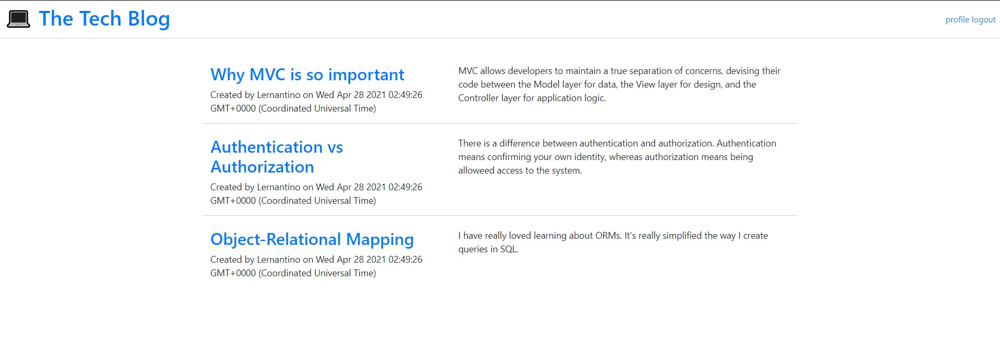
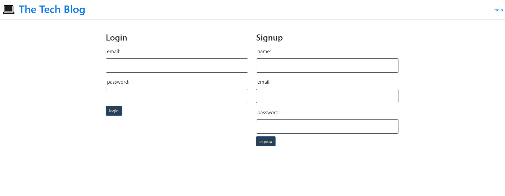

[![LinkedIn][linkedin-shield]][linkedin-url]

# Tech-Blog

https://the-tech-blog-3.herokuapp.com/

## Description

Tech-Blog allows users to post and comment about tech topics. The users will be required to log in if they wish to view the posts and comments.

## Table of Contents

- [Installation](#installation)
- [Usage](#usage)
- [Credits](#credits)
- [License](#license)
- [Contributing](#contributing)
- [Tests](#tests)
- [Questions](#questions)

## Installation

Open up Tech-Blog and create an account. After creating an account, the user will be sent to their profile where they have the option of creating a post or clicking on Tech-Blog to view all other users blog posts.

## License

License:

MIT

## Contributing

Created by [https://github.com/UnDuhDuhSea](https://github.com/https://github.com/UnDuhDuhSea)

## Questions

Please feel free to send me an email or reach out on github!

Github: [https://github.com/UnDuhDuhSea](https://github.com/https://github.com/UnDuhDuhSea)

Email: [tafimba@gmail.com](https://github.com/tafimba@gmail.com)

<!-- MARKDOWN LINKS & IMAGES -->

[linkedin-shield]: https://img.shields.io/badge/-LinkedIn-black.svg?style=for-the-badge&logo=linkedin&colorB=555
[linkedin-url]: www.linkedin.com/in/tyler-abegg
